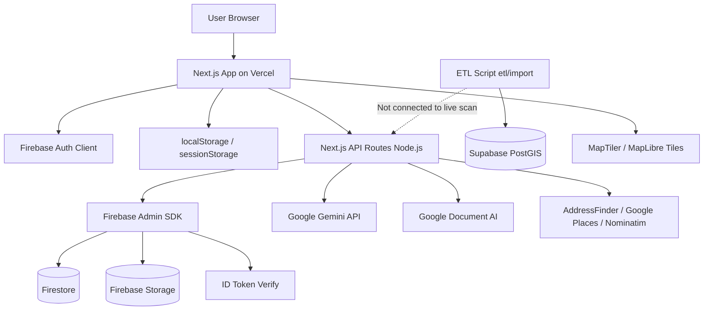

# Technical Architecture

## Stack summary

| Layer | Technology | Version (from `package.json`) |
|-------|------------|-------------------------------|
| Framework | Next.js App Router | 16.2.6 |
| UI | React | 19.2.4 |
| Language | TypeScript | ^5 |
| Styling | Tailwind CSS | ^4 |
| UI primitives | Radix UI, shadcn-style components | Various |
| Client state | Zustand (persist) | ^5.0.14 |
| Server data fetching | TanStack Query | ^5.100.14 (provider only; limited usage) |
| Validation | Zod | ^4.4.3 |
| Maps | MapLibre GL | ^5.24.0 |
| Animation | Framer Motion | ^12.40.0 |

## Frontend structure

```
src/app/           # App Router pages + API routes (colocated)
src/components/    # Feature + UI components
src/providers/     # AuthProvider, QueryProvider
src/stores/        # Zustand (localStorage persist)
src/lib/           # Business logic, integrations, schemas
```

Rendering: Mostly **client components** (`"use client"`) on interactive pages. Root layout is server component (`src/app/layout.tsx`).

## Backend / API structure

All backend logic is **Next.js Route Handlers** under `src/app/api/`:

- No separate Express/Fastify server
- No Server Actions found for core flows (grep: API routes used instead)
- `export const runtime = "nodejs"` on heavy routes (strata upload/process, user)
- `maxDuration` up to **300s** on strata process route (Vercel Pro required for >60s — **needs verification** on current Vercel plan)

## Database & storage (dual system — important)

### Firebase (runtime — active)

| Service | Use |
|---------|-----|
| **Firebase Auth** | Google + email sign-in (client SDK) |
| **Firestore** | Users, strata documents, inspections, properties/scans, saved reports, property_cases |
| **Firebase Storage** | Strata PDF files |

Admin access via `firebase-admin` (`src/lib/firebase/admin.ts`).

### Supabase + PostGIS (schema + ETL — partially active)

| Service | Use |
|---------|-----|
| **PostgreSQL + PostGIS** | Migrations in `supabase/migrations/` |
| **ETL import** | `etl/pipelines/import-geojson.ts` loads via Supabase service role |
| **Spatial function** | `scan_nearby_property()` in `003_spatial_functions.sql` |

**The live scan API does NOT call Supabase.** It uses Firestore collections with client-side haversine filtering (`src/lib/firebase/scan.ts`).

### Local / browser storage

| Store | Key |
|-------|-----|
| Compare | `propertytruth-compare` |
| Shortlist | `propertytruth-shortlist` |
| Due diligence | `propertytruth-due-diligence` |
| Inspections | `propertytruth-inspections` |
| Buyer profile | `propertytruth-buyer-profile` |
| Document vault | `propertytruth-documents` |
| Scan cache | `sessionStorage` `scan:{id}` |
| Strata/inspection session | `localStorage` `strata-session`, `inspection-session` |

## Authentication

| Layer | Mechanism |
|-------|-----------|
| User sign-in | Firebase client Auth (`src/lib/firebase/client.ts`) |
| API user routes | `Authorization: Bearer <Firebase ID token>` verified by Admin SDK |
| Strata/inspection (anonymous) | `x-strata-session` / `x-inspection-session` UUID in localStorage |
| Strata process (internal) | `x-internal-process-secret` header |
| Supabase Auth | Migrations reference `auth.users`; **not used** in app code |

Auth provider: `src/providers/auth-provider.tsx`  
Access control: `src/lib/auth/access.ts`

## AI & document processing

| Provider | Use | Files |
|----------|-----|-------|
| **Google Gemini 2.0 Flash** | Area insights, strata findings, strata Q&A | `src/lib/ai/gemini.ts`, `src/lib/strata/extractors/gemini-section.ts`, `src/lib/strata/analyze.ts` |
| **Google Document AI** | OCR fallback for scanned PDFs | `src/lib/document-ai/ocr.ts` |
| **unpdf** | Native PDF text extraction | `src/lib/strata/pdf-extract.ts` |

## Third-party services

| Service | Purpose | Config |
|---------|---------|--------|
| AddressFinder | AU address autocomplete/geocode (preferred) | `ADDRESSFINDER_*` |
| Google Places | Autocomplete/geocode fallback | `GOOGLE_PLACES_API_KEY` |
| Nominatim (OSM) | Autocomplete fallback | No key |
| MapTiler | Map tiles (optional) | `NEXT_PUBLIC_MAPTILER_API_KEY` |
| MapLibre demo tiles | Default map style | `NEXT_PUBLIC_MAPLIBRE_STYLE_URL` |
| Stripe | Planned payments | Env vars present; **not implemented** |
| PostHog | Analytics | Stub only |

## Deployment assumptions

- **Vercel** for hosting (user confirmed `propertytruth.vercel.app`)
- **Node.js runtime** for API routes using Firebase Admin, file buffers, Document AI
- Firebase service account via `FIREBASE_SERVICE_ACCOUNT_JSON` on Vercel (file path does not work serverless)
- Environment variables per `.env.example`

## Environment variables (grouped)

See `/.env.example` for full list. Critical groups:

1. **Firebase client** — `NEXT_PUBLIC_FIREBASE_*`
2. **Firebase admin** — `FIREBASE_SERVICE_ACCOUNT_JSON` OR `FIREBASE_ADMIN_*`
3. **AI** — `GEMINI_API_KEY`, `GOOGLE_DOCUMENT_AI_*`
4. **Geocoding** — `ADDRESSFINDER_*`, `GOOGLE_PLACES_API_KEY`
5. **Internal** — `INTERNAL_PROCESS_SECRET`
6. **Supabase** — `NEXT_PUBLIC_SUPABASE_*`, `SUPABASE_SERVICE_ROLE_KEY` (ETL only today)
7. **Stripe** — optional, unused

## High-level architecture diagram



## Architectural risks (for reviewer)

1. **Two databases** without sync bridge
2. **Firestore full collection scan** for spatial queries (does not scale)
3. **In-memory rate limits** on serverless
4. **Long-running strata pipeline** in single HTTP request (300s cap)

## TODO

- [ ] Confirm Vercel plan limits (execution time, memory)
- [ ] Confirm whether Supabase project exists in production
