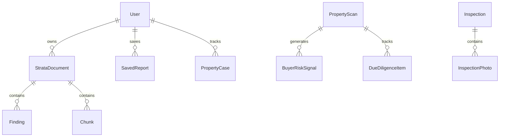

# Data Model

This app has **two parallel data models**: Supabase (SQL migrations) and Firebase Firestore (runtime). Unless noted, **runtime behavior uses Firestore**.

---

## Firebase Firestore (inferred from code — primary runtime)

### Collection: `users`

**Schema:** `src/lib/auth/user-schema.ts` (`userDocumentSchema`)

| Field | Type | Notes |
|-------|------|-------|
| `uid` | string | Document ID = Firebase Auth UID |
| `email` | string | Synced from auth |
| `displayName` | string | |
| `photoURL` | string \| null | |
| `phone` | string \| null | |
| `preferences` | object | emailNotifications, scan radius, strata retention, etc. |
| `buyerProfile` | object | budget, dealbreakers, riskAppetite, etc. |
| `onboardingCompleted` | boolean | |
| `createdAt`, `updatedAt` | ISO string | |

**Access:** `src/lib/firebase/users.ts`

---

### Collection: `strata_documents`

**Inferred from:** `src/lib/firebase/strata.ts`, `src/lib/strata/schemas.ts`, `process-pipeline.ts`

| Field | Type | Notes |
|-------|------|-------|
| `filename` | string | Sanitized on upload |
| `storagePath` | string | Firebase Storage path |
| `clientSessionId` | string | Anonymous session binding |
| `userId` | string \| null | Set when authenticated |
| `propertyCaseId` | string \| null | Optional link |
| `status` | enum | uploaded / processing / ready / failed |
| `processingStatus` | enum | Granular pipeline stages |
| `fileHash` | string | SHA-256 dedup |
| `retentionPolicy` | 7d \| 30d \| keep | |
| `retentionExpiresAt` | string \| null | Not enforced by cron |
| `pageCount`, `findingCount`, etc. | various | Pipeline metadata |
| `summary` | object | `StrataReviewSummary` |
| `errorMessage`, `errorCode` | string \| null | |

**Subcollections (inferred):** `findings`, `sections`, `chunks` (via pipeline writes)

---

### Collection: `document_jobs`

| Field | Notes |
|-------|-------|
| `docId` | strata document ID |
| `jobType` | `strata_analysis` |
| `status` | running / complete / failed |
| `attemptCount` | |

---

### Collection: `properties`

Created on scan (`src/lib/firebase/scan.ts`):

| Field | Notes |
|-------|-------|
| `formattedAddress`, `lat`, `lng`, `suburb`, `postcode` | |
| `scanSnapshot` | Full `PropertyScanResult` JSON |
| `createdAt` | |

---

### Collection: `developments`, `infrastructure`, `zoning`, `risk_overlays`

Firestore collections queried by haversine distance in `firebase/scan.ts`. Expected fields mirror Zod schemas in `src/lib/schemas.ts` (`lat`, `lng`, etc.).

**Status:** Often empty → triggers demo scan fallback.

---

### Collection: `saved_reports`

| Field | Notes |
|-------|-------|
| `userId` | Firebase UID |
| `propertyId` | string |
| `summary` | JSON blob |
| `createdAt` | |

**API:** POST only (`src/app/api/saved/route.ts`)

---

### Collection: `inspections`

| Field | Notes |
|-------|-------|
| `propertyAddress`, `propertyType` | |
| `clientSessionId`, `userId` | Access control |
| `status` | in_progress / etc. |

**Subcollections:** `rooms`, `items`, `photos` (partial — see `firebase/inspections.ts`)

---

### Collection: `property_cases` (+ subcollection `risk_signals`)

Defined in `src/lib/firebase/property-cases.ts`. Mirrors Supabase migration `008_property_cases.sql`.

**Status:** Helpers exist; **no app route or page calls `createPropertyCase`**.

---

## Supabase PostgreSQL (migrations — ETL / planned)

Files: `supabase/migrations/001` through `008`

### Core tables (`002_core_schema.sql`)

- `users` — references `auth.users`
- `properties` — geography point
- `development_applications` — DA records with geometry
- `infrastructure_projects`
- `zoning_overlays`
- `saved_reports`

### Spatial (`003_spatial_functions.sql`, `006_risk_overlays.sql`)

- `scan_nearby_property(lat, lng, radius_meters)` — PostGIS `ST_DWithin`, etc.
- `risk_overlays` table + updated scan function

### Strata (`007_strata_documents.sql`)

- `documents`, `document_pages`, `document_chunks`, `document_findings`
- Enums for status, severity, confidence

### Buyer workspace (`008_property_cases.sql`)

- `property_cases`, `buyer_risk_signals`, `due_diligence_items`
- RLS policies for user-owned rows

**Runtime connection:** None in `src/app/api/scan` — **schema is ahead of app wiring**.

---

## Client-side models (Zustand / localStorage)

| Store | Model | File |
|-------|-------|------|
| Compare | `PropertyScanResult[]` max 4 | `compare-store.ts` |
| Shortlist | `PropertyScanResult[]` max 20 | `shortlist-store.ts` |
| Due diligence | `Record<propertyId, DueDiligenceItem[]>` | `due-diligence-store.ts` |
| Inspection | `Inspection` with rooms/items/photos | `inspection-store.ts` |
| Document vault | `VaultDocument[]` metadata only | `document-vault-store.ts` |
| Buyer profile | `BuyerProfile` | `buyer-profile-store.ts` |

---

## Key entity relationships (conceptual)

---

## Validation logic

| Domain | Validator |
|--------|-----------|
| API requests | Zod in `src/lib/schemas.ts`, `src/lib/auth/user-schema.ts`, `src/lib/strata/schemas.ts` |
| Client stores | `propertyScanResultSchema.parse()` on compare/shortlist add |
| Firestore reads | `userDocumentSchema.parse()`, `strataDocumentSchema.parse()` |

---

## Data lifecycle risks

| Risk | Severity | Detail |
|------|----------|--------|
| Duplicate user data | Medium | Firebase `users` vs localStorage buyer profile can drift |
| Orphan strata docs | Medium | Anonymous session without account link if localStorage cleared |
| No retention enforcement | Medium | `retentionExpiresAt` never processed |
| Demo data in Firestore | Low | `scanSnapshot` may store demo payloads |
| Supabase/Firebase drift | High | ETL loads Supabase; app reads Firestore |
| Full collection scans | High | Firestore `get()` on entire `developments` collection |
| Missing composite index | Medium | Strata dedup query `fileHash` + `processingStatus` may need Firestore index |
| No saved report retrieval | Low | Writes without read path |

---

## TODO

- [ ] Export actual Firestore security rules (Unknown — may be open via Admin SDK only today)
- [ ] Confirm production collection population status
