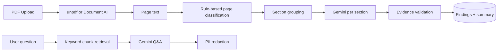

# AI Implementation

PropertyTruth **does use AI** extensively for summarisation and document analysis.

## Where AI is used

| Use case | Provider | Model / service | Files |
|----------|----------|-----------------|-------|
| Property area insight | Google Gemini | `gemini-2.0-flash` | `src/lib/ai/gemini.ts` |
| Strata section extraction | Google Gemini | `gemini-2.0-flash` (via extractors) | `src/lib/strata/extractors/gemini-section.ts` |
| Strata legacy chunk analysis | Google Gemini | `gemini-2.0-flash` | `src/lib/strata/analyze.ts` |
| Strata Q&A | Google Gemini | `gemini-2.0-flash` | `src/lib/strata/analyze.ts` (`answerStrataQuestion`) |
| Scanned PDF OCR | Google Document AI | Processor ID in env | `src/lib/document-ai/ocr.ts` |
| PDF text (non-AI) | unpdf | Local extraction | `src/lib/strata/pdf-extract.ts` |

## Prompt structure

### Area insight (`generateAreaInsight`)

- **System instruction:** Planning assistant; no price predictions; no legal advice; max 120 words
- **User content:** JSON of developments, infrastructure, zoning, risk indicators from scan
- **Output:** Parsed via `aiInsightResponseSchema` — summary, confidence, sources, disclaimer
- **Fallback:** Static canned summary if `GEMINI_API_KEY` missing

### Strata findings (section extractors)

- Per-section prompts with category lists (special levies, defects, cladding, etc.)
- Rules: verbatim `supporting_quote`, page numbers, no fabrication
- JSON response parsed and validated through `evidence.ts`

### Strata Q&A (`answerStrataQuestion`)

- Retrieval: keyword-based `retrieveRelevantChunks()` — top 8 chunks (`src/lib/strata/retrieve.ts`)
- Not vector/RAG embedding search
- Answer redacted for PII via `redactPii()` before return

## Retrieval / context strategy

**No vector database** (Pinecone, pgvector, etc.) found in codebase.

## Input data sent to AI

| Flow | Data sent |
|------|-----------|
| Area insight | Aggregated scan JSON (DAs, infra, zoning) — no raw PDF |
| Strata extraction | Section text up to ~48k chars (`MAX_SECTION_CHARS` in extractors) |
| Strata Q&A | Up to 8 text chunks + user question |

## Output format

- Strata findings: Zod-validated `DocumentFinding[]` with `supportingQuote`, `pageNumber`, `severity`, `confidence`
- Strata summary: `StrataReviewSummary` — headline, topRisks, questionsForConveyancer, sectionCoverage
- Area insight: `{ summary, confidence, sources, disclaimer }`

## Guardrails

| Guardrail | Implementation |
|-----------|----------------|
| Disclaimers | `src/lib/compliance/copy.ts`, appended to AI outputs |
| Evidence validation | `src/lib/strata/evidence.ts` — quote must appear in source text |
| PII redaction | `src/lib/compliance/redact.ts` — email, phone, BSB, owner names |
| Upload consent | `UploadConsentPanel` before strata upload |
| No training claim | `NO_TRAINING_STATEMENT` in UI |
| System prompts | Instruct no legal/financial advice, no fabrication |
| Process endpoint lock | Internal secret for background processing |

## Cost & rate-limit risks

| Risk | Detail |
|------|--------|
| Unauthenticated insight API | Anyone can trigger Gemini via `/api/property/[id]/insights` |
| Large PDFs | 100–500 page bundles → many Gemini calls per section |
| Document AI OCR | Expensive fallback when unpdf fails |
| No per-user AI budget | Only IP/session rate limits |
| Demo fallback masks missing key | App works without Gemini but with fake findings |

## Hallucination risks

| Area | Risk level | Mitigation |
|------|------------|------------|
| Strata findings | Medium | Quote validation; `needsProfessionalReview` flag |
| Strata Q&A | Medium-High | Keyword retrieval may miss context; answers can overreach |
| Area insight | Medium | Grounded in scan JSON but may over-interpret |
| Demo findings | N/A | `buildDemoFindingsFromChunks` when no API key — not AI |

## Where AI should vs should not be used

| Should use AI | Should NOT use AI (human/professional) |
|---------------|----------------------------------------|
| Plain-English summaries of cited data | Legal advice on contracts |
| Highlighting document excerpts | Structural building assessments |
| Generating questions for conveyancer | Valuation / price guidance |
| Organising checklist gaps | Insurance underwriting decisions |

Product copy aligns with this split via disclaimers and "professional review gate" UI.

## TODO

- [ ] Document actual Gemini token usage / cost per average strata bundle
- [ ] Evaluate embedding-based RAG vs keyword retrieval for Q&A
- [ ] Confirm Document AI processor type and region in production
